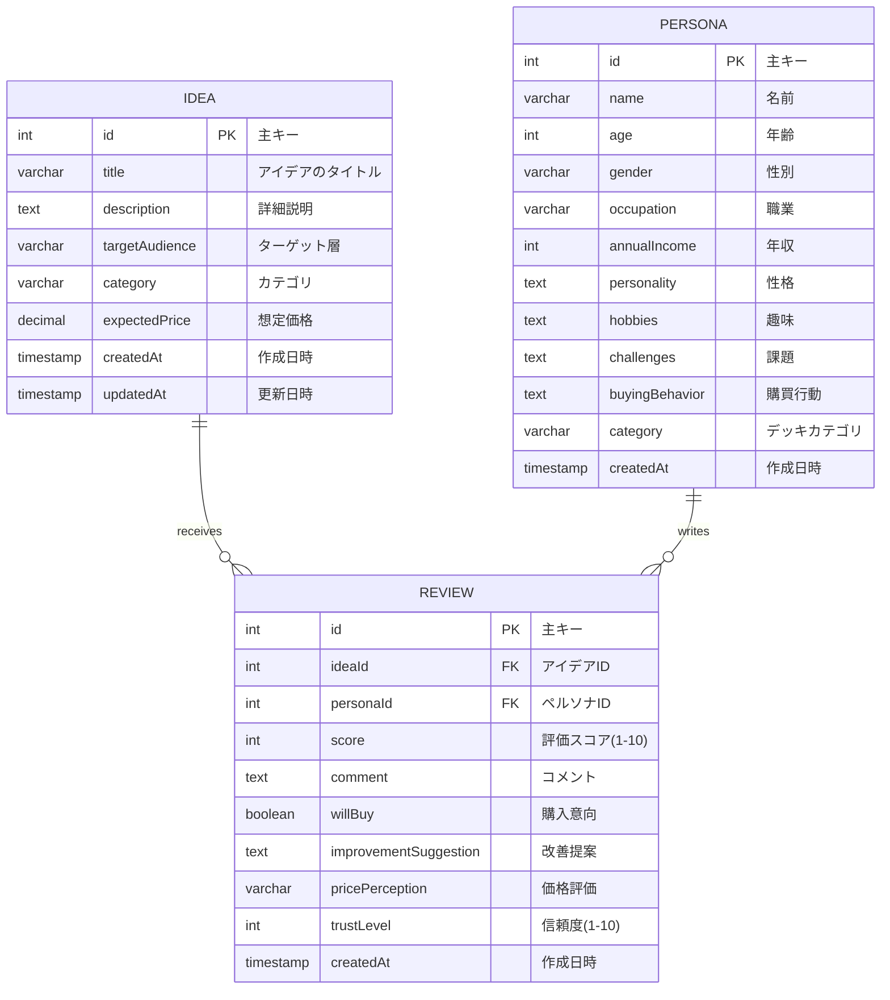

# Market Mirror - データベース設計書

## 概要
Market Mirrorは、ビジネスアイデアを30人の多様なペルソナによって評価するシステムです。

## ER図



## テーブル設計

### 1. ideas テーブル
アイデア情報を管理するテーブル

| カラム名 | データ型 | 制約 | 説明 |
|---------|---------|------|------|
| id | INTEGER | PRIMARY KEY, AUTO_INCREMENT | 主キー |
| title | VARCHAR(200) | NOT NULL | アイデアのタイトル |
| description | TEXT | NOT NULL | アイデアの詳細説明 |
| targetAudience | VARCHAR(500) | NOT NULL | ターゲット層の説明 |
| category | VARCHAR(100) | NULL | カテゴリ（Standard_Japan, Inbound_Tourist, Biz_Tech） |
| expectedPrice | DECIMAL(10,2) | NULL | 想定価格 |
| createdAt | TIMESTAMP | NOT NULL, DEFAULT NOW() | 作成日時 |
| updatedAt | TIMESTAMP | NOT NULL | 更新日時 |

**インデックス:**
- PRIMARY KEY (id)

---

### 2. personas テーブル
ペルソナ（評価者）情報を管理するテーブル

| カラム名 | データ型 | 制約 | 説明 |
|---------|---------|------|------|
| id | INTEGER | PRIMARY KEY, AUTO_INCREMENT | 主キー |
| name | VARCHAR(100) | NOT NULL | ペルソナの名前 |
| age | INTEGER | NOT NULL | 年齢 |
| gender | VARCHAR(20) | NOT NULL | 性別 |
| occupation | VARCHAR(100) | NOT NULL | 職業 |
| annualIncome | INTEGER | NOT NULL | 年収 |
| personality | TEXT | NOT NULL | 性格・特徴 |
| hobbies | TEXT | NOT NULL | 趣味 |
| challenges | TEXT | NOT NULL | 抱えている課題 |
| buyingBehavior | TEXT | NOT NULL | 購買行動の特徴 |
| category | VARCHAR(100) | NOT NULL | デッキカテゴリ |
| createdAt | TIMESTAMP | NOT NULL, DEFAULT NOW() | 作成日時 |

**インデックス:**
- PRIMARY KEY (id)
- INDEX (category) - カテゴリでの検索用

**カテゴリ値:**
- `Standard_Japan`: 日本の標準的な人口分布
- `Inbound_Tourist`: 訪日外国人観光客
- `Biz_Tech`: ビジネス・テック業界

---

### 3. reviews テーブル
アイデアに対するペルソナの評価を管理するテーブル

| カラム名 | データ型 | 制約 | 説明 |
|---------|---------|------|------|
| id | INTEGER | PRIMARY KEY, AUTO_INCREMENT | 主キー |
| ideaId | INTEGER | NOT NULL, FOREIGN KEY | アイデアID（外部キー） |
| personaId | INTEGER | NOT NULL, FOREIGN KEY | ペルソナID（外部キー） |
| score | INTEGER | NOT NULL | 評価スコア (1-10) |
| comment | TEXT | NOT NULL | 詳細なコメント |
| willBuy | BOOLEAN | NOT NULL | 購入意向 (true/false) |
| improvementSuggestion | TEXT | NOT NULL | 改善提案 |
| pricePerception | VARCHAR(50) | NULL | 価格に対する評価 |
| trustLevel | INTEGER | NULL | 信頼度 (1-10) |
| createdAt | TIMESTAMP | NOT NULL, DEFAULT NOW() | 作成日時 |

**インデックス:**
- PRIMARY KEY (id)
- FOREIGN KEY (ideaId) REFERENCES ideas(id) ON DELETE CASCADE
- FOREIGN KEY (personaId) REFERENCES personas(id) ON DELETE CASCADE
- UNIQUE (ideaId, personaId) - 1つのペルソナは1つのアイデアに1回だけレビュー可能
- INDEX (ideaId) - アイデアに紐づくレビュー検索用
- INDEX (personaId) - ペルソナに紐づくレビュー検索用

---

## リレーションシップ

### 1. Idea と Review (1対多)
- 1つの `Idea` は複数の `Review` を持つことができる
- カスケード削除: アイデアが削除されると、関連するレビューも削除される

### 2. Persona と Review (1対多)
- 1つの `Persona` は複数の `Review` を書くことができる
- カスケード削除: ペルソナが削除されると、関連するレビューも削除される

### 3. Idea と Persona (多対多)
- `Review` テーブルを介して多対多の関係
- 1つのアイデアは複数のペルソナから評価される
- 1つのペルソナは複数のアイデアを評価できる
- ユニーク制約により、同じペルソナが同じアイデアに対して複数回レビューすることはできない

---

## 制約とビジネスルール

### 制約
1. **外部キー制約**: reviewsテーブルはideasとpersonasテーブルへの外部キーを持つ
2. **カスケード削除**: 親レコードの削除時に関連する子レコードも削除
3. **ユニーク制約**: (ideaId, personaId) の組み合わせは一意
4. **NOT NULL制約**: 必須フィールドにはNULL値を許可しない

### ビジネスルール
1. **スコアの範囲**: scoreとtrustLevelは1〜10の範囲
2. **カテゴリの一致**: アイデアのcategoryとペルソナのcategoryが一致するペルソナがレビューを行う
3. **レビューの一意性**: 1つのペルソナは1つのアイデアに対して1回だけレビュー可能
4. **購入意向**: willBuyフィールドで購入意向を明確に記録

---

## データ整合性

### トランザクション管理
- 複数のレビューを一度に作成する際は、トランザクションを使用して整合性を保証
- 失敗時のロールバック機能を実装

### インデックス戦略
- 頻繁に検索されるカラム（category, ideaId, personaId）にインデックスを配置
- ユニーク制約により重複データの防止

---

## サンプルクエリ

### 1. 特定のアイデアに対する全レビューを取得
```sql
SELECT r.*, p.name, p.age, p.occupation
FROM reviews r
JOIN personas p ON r.personaId = p.id
WHERE r.ideaId = 1
ORDER BY r.score DESC;
```

### 2. アイデアの平均スコアを計算
```sql
SELECT 
  i.id,
  i.title,
  AVG(r.score) as avg_score,
  COUNT(r.id) as review_count,
  SUM(CASE WHEN r.willBuy THEN 1 ELSE 0 END) as buy_count
FROM ideas i
LEFT JOIN reviews r ON i.id = r.ideaId
GROUP BY i.id, i.title;
```

### 3. カテゴリ別のペルソナ数
```sql
SELECT category, COUNT(*) as persona_count
FROM personas
GROUP BY category;
```

---

## マイグレーション履歴

### Migration: 20251218070640_add_market_mirror_models
- 初期テーブル作成（ideas, personas, reviews）
- 外部キー制約の設定
- インデックスの作成

### Migration: 20251219010807_add_persona_category
- personasテーブルにcategoryフィールドを追加
- デッキ管理機能の実装

---

## パフォーマンス最適化

### 実装済み
- 外部キーカラムへのインデックス配置
- ユニーク制約による重複チェックの高速化

### 今後の改善案
- レビュー数が多い場合のページネーション
- マテリアライズドビューによる集計の高速化
- キャッシュ戦略の導入

---

## セキュリティ考慮事項

1. **SQL インジェクション対策**: Prisma ORMを使用してパラメータ化クエリを実行
2. **データ検証**: アプリケーション層でのバリデーション実装
3. **カスケード削除**: 意図しないデータ損失を防ぐため、削除操作は慎重に実行

---

## バックアップとリカバリ

推奨バックアップ戦略:
1. **定期バックアップ**: 日次でデータベース全体をバックアップ
2. **トランザクションログ**: ポイントインタイムリカバリ用
3. **テストデータの保持**: シードデータでいつでも初期状態に復元可能

---

作成日: 2025-12-19
最終更新: 2025-12-19
