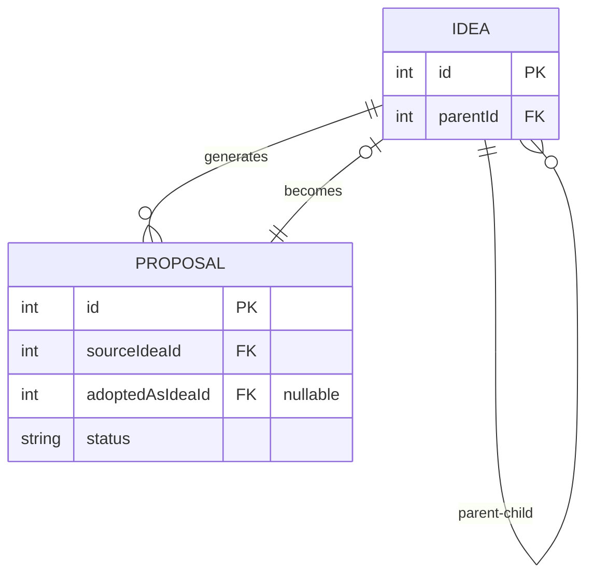

# 📊 改善案管理機能

## 🎯 コンセプト

**すべての改善案（良い案も悪い案も、採用されなかった案も）をデータベースに保存**

これにより：
- AIの思考過程を記録
- 試行錯誤の履歴を残す
- 失敗から学べる
- A/Bテスト的な比較が可能

---

## 📐 データベース設計

### Proposalモデル

```prisma
model Proposal {
  id                Int      @id @default(autoincrement())
  sourceIdeaId      Int      // どのアイデアから生成されたか
  title             String   
  description       String   
  targetAudience    String   
  status            String   @default("pending") // pending/adopted/rejected
  adoptedAsIdeaId   Int?     // 採用された場合の新アイデアID
  aiReasoning       String?  // AIがこの案を提案した理由
  estimatedScore    Decimal? // AIが予測するスコア
  selectionReason   String?  // 採用/不採用の理由
  createdAt         DateTime
  adoptedAt         DateTime?
}
```

### リレーション

```
Idea (v1)
  ├─ Review (10人分の評価)
  └─ Proposal (AIが生成した改善案)
       ├─ Proposal A (推定スコア 8.5) ✅ 採用 → Idea (v2)
       ├─ Proposal B (推定スコア 7.8) ❌ 不採用
       ├─ Proposal C (推定スコア 7.2) ❌ 不採用
       └─ Proposal D (推定スコア 6.9) ❌ 不採用

Idea (v2)
  ├─ Review (10人分の評価)
  └─ Proposal (さらに改善案)
       ├─ Proposal E (推定スコア 9.0) ✅ 採用 → Idea (v3)
       └─ ...
```

---

## 🔄 フロー

### 1. 評価完了後

```
Idea (v1) + Reviews (10人分)
   ↓
AIが分析
   ↓
複数の改善案を生成（3-5個）
   ↓
すべてProposalテーブルに保存（status: pending）
```

### 2. 改善案の選択

#### 自動モード
```typescript
// 最高スコアの案を自動採用
const bestProposal = proposals.sort((a, b) => b.estimatedScore - a.estimatedScore)[0];
await adoptProposal(bestProposal.id, "推定スコア最高のため自動採用");

// 他の案は自動的に status: rejected に更新
```

#### 手動モード
```
ユーザーが改善案一覧ページで確認
   ↓
好きな案を選択
   ↓
adoptProposal(proposalId, "〇〇の理由で採用")
```

### 3. 採用処理

```typescript
await prisma.$transaction([
  // 元のアイデアを "improved" に更新
  prisma.idea.update({ 
    where: { id: sourceIdeaId },
    data: { status: 'improved' }
  }),
  
  // 新バージョンを作成
  prisma.idea.create({
    data: {
      title: proposal.title,
      description: proposal.description,
      version: sourceIdea.version + 1,
      parentId: sourceIdeaId,
    }
  }),
  
  // 採用された案を更新
  prisma.proposal.update({
    where: { id: proposalId },
    data: {
      status: 'adopted',
      adoptedAsIdeaId: newIdea.id,
      adoptedAt: new Date(),
    }
  }),
  
  // 他の未採用案を rejected に更新
  prisma.proposal.updateMany({
    where: {
      sourceIdeaId,
      status: 'pending',
      id: { not: proposalId }
    },
    data: {
      status: 'rejected',
      selectionReason: '他の案が採用されたため不採用'
    }
  })
]);
```

---

## 🎨 UI

### 1. レポートページ

```
┌─────────────────────────────────┐
│ アイデアレポート                │
│                                 │
│ [💡 改善案を見る (3)]           │
│ [🔄 PDCA実行]                   │
└─────────────────────────────────┘
```

### 2. 改善案一覧ページ (`/proposals/[id]`)

```
┌─────────────────────────────────┐
│ 💡 改善案一覧                   │
├─────────────────────────────────┤
│ 📊 統計                         │
│ • 生成された改善案: 3件         │
│ • 採用済み: 1件                 │
│ • 不採用: 2件                   │
├─────────────────────────────────┤
│ 🔍 未採用の改善案               │
│                                 │
│ 💡 案1: タイトル                │
│ 説明...                         │
│ 🤖 AIの推論: ...                │
│ 予測スコア: 8.5 (+1.2)         │
│ [✓ この案を採用]               │
│                                 │
│ 💡 案2: タイトル                │
│ ...                             │
├─────────────────────────────────┤
│ ✅ 採用済みの改善案             │
│ ❌ 不採用の改善案               │
└─────────────────────────────────┘
```

---

## 💾 データ例

### 生成された改善案（モック）

```json
[
  {
    "id": 1,
    "sourceIdeaId": 1,
    "title": "家計簿アプリ 機能強化版",
    "description": "レシートを撮影して自動記録する\n\n【機能追加】\n• AIによる自動分析機能\n• リアルタイム通知\n• データエクスポート機能",
    "aiReasoning": "機能を充実させることで、ユーザーの利便性が向上し、継続利用率が高まると予測",
    "estimatedScore": 8.5,
    "status": "adopted",
    "adoptedAsIdeaId": 2,
    "selectionReason": "推定スコア 8.5 で最も高評価のため自動採用",
    "adoptedAt": "2025-12-19T12:00:00Z"
  },
  {
    "id": 2,
    "sourceIdeaId": 1,
    "title": "家計簿アプリ 価格最適化版",
    "description": "レシートを撮影して自動記録する\n\n【価格戦略】\n• 無料プラン: 基本機能\n• スタンダード: 月額500円",
    "aiReasoning": "段階的な価格設定により、幅広いユーザー層を獲得できると予測",
    "estimatedScore": 7.8,
    "status": "rejected",
    "selectionReason": "他の案が採用されたため不採用"
  },
  {
    "id": 3,
    "sourceIdeaId": 1,
    "title": "家計簿アプリ UI/UX改善版",
    "description": "...",
    "estimatedScore": 7.2,
    "status": "rejected",
    "selectionReason": "他の案が採用されたため不採用"
  }
]
```

---

## 🔍 クエリ例

### 1. アイデアの改善案を取得

```typescript
const proposals = await prisma.proposal.findMany({
  where: { sourceIdeaId: 1 },
  orderBy: [
    { status: 'asc' },      // pending -> adopted -> rejected
    { estimatedScore: 'desc' }
  ]
});
```

### 2. 採用された改善案のみ取得

```typescript
const adoptedProposals = await prisma.proposal.findMany({
  where: {
    sourceIdeaId: 1,
    status: 'adopted'
  },
  include: {
    adoptedIdea: true  // 次のバージョンを含める
  }
});
```

### 3. 全バージョンの改善案履歴

```typescript
// v1, v2, v3... すべての改善案を取得
const allProposals = await prisma.proposal.findMany({
  where: {
    sourceIdeaId: { in: [1, 2, 3, 4, 5] } // 全バージョンのID
  },
  include: {
    sourceIdea: {
      select: { version: true }
    }
  }
});

// バージョンごとにグループ化
const byVersion = groupBy(allProposals, 'sourceIdea.version');
```

### 4. 改善の成功率を分析

```typescript
const stats = await prisma.proposal.groupBy({
  by: ['status'],
  _count: true,
  _avg: { estimatedScore: true }
});

// 結果:
// [
//   { status: 'adopted', _count: 5, _avg: { estimatedScore: 8.2 } },
//   { status: 'rejected', _count: 15, _avg: { estimatedScore: 7.1 } }
// ]
```

---

## 📊 活用例

### 1. A/Bテスト的な比較

```
複数の改善案を生成
   ↓
それぞれ実際に評価させる（並列実行）
   ↓
最も高スコアの案を採用
```

### 2. 失敗から学ぶ

```sql
-- 不採用だった案の共通点を分析
SELECT 
  COUNT(*) as count,
  AVG(estimatedScore) as avg_score
FROM proposals
WHERE status = 'rejected'
  AND aiReasoning LIKE '%価格%'
```

### 3. AIの予測精度を測定

```typescript
// 予測スコアと実際のスコアを比較
const proposal = await prisma.proposal.findUnique({
  where: { id: proposalId },
  include: {
    adoptedIdea: {
      include: { reviews: true }
    }
  }
});

const actualScore = average(proposal.adoptedIdea.reviews.map(r => r.score));
const predictedScore = proposal.estimatedScore;
const accuracy = 1 - Math.abs(actualScore - predictedScore) / 10;

console.log(`AI予測精度: ${(accuracy * 100).toFixed(1)}%`);
```

---

## 🎓 学習ポイント（データベース授業向け）

### 1. 複雑なリレーション

- **自己参照**: Idea → Idea（親子）
- **多対多**: Idea ←→ Persona（Reviewテーブル経由）
- **オプショナル参照**: Proposal → Idea（採用された場合のみ）



### 2. ステータス管理

```typescript
enum ProposalStatus {
  PENDING = 'pending',    // 未選択
  ADOPTED = 'adopted',    // 採用
  REJECTED = 'rejected'   // 不採用
}
```

### 3. トランザクションの重要性

採用処理は複数のテーブル更新を含むため、トランザクション必須：
- Ideaの status更新
- 新Ideaの作成
- Proposalの status更新
- 他Proposalの一括更新

### 4. インデックス最適化

```sql
CREATE INDEX idx_proposals_source_status 
ON proposals(sourceIdeaId, status);

CREATE INDEX idx_proposals_estimated_score 
ON proposals(estimatedScore DESC);
```

---

## 🚀 将来の拡張案

### 1. 改善案の投票機能

```typescript
model ProposalVote {
  id         Int @id
  proposalId Int
  userId     Int
  vote       Int // 1-5
}
```

### 2. 改善案のコメント

```typescript
model ProposalComment {
  id         Int @id
  proposalId Int
  userId     Int
  comment    String
}
```

### 3. 改善案のフォーク

```
Proposal A (不採用)
   ↓ フォーク
Proposal A' (修正版)
   ↓ 再評価
採用
```

---

## 📝 まとめ

改善案管理機能により：

1. ✅ **完全な履歴** - すべての試行錯誤を記録
2. ✅ **透明性** - AIの思考過程が可視化
3. ✅ **学習機会** - 失敗から学べる
4. ✅ **データ分析** - 改善パターンを発見
5. ✅ **課題要件** - データベース設計の実践

---

作成日: 2025-12-19
