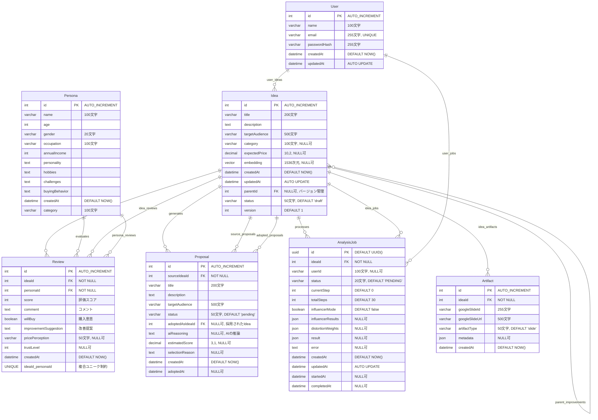

# データベース設計 (ER図)

## 概要
Market Mirrorアプリケーションのデータベース設計をMermaid.js形式で表現したER図です。

## ER図

## テーブル間のリレーション詳細

### 1. Idea（アイデア）
- **自己参照リレーション**: `parentId` → `Idea.id`（バージョン管理）
- **1対多**: `Idea` → `Review`（1つのアイデアに複数のレビュー）
- **1対多**: `Idea` → `Proposal`（1つのアイデアから複数の提案を生成）
- **1対多**: `Idea` → `AnalysisJob`（1つのアイデアに複数の分析ジョブ）
- **1対多**: `Idea` → `Artifact`（1つのアイデアから複数の成果物を生成）

### 2. Persona（ペルソナ）
- **マスタデータ**: 90人のAIペルソナが事前定義
- **1対多**: `Persona` → `Review`（1つのペルソナが複数のアイデアを評価）

### 3. Review（レビュー/フィードバック）
- **多対多の実装**: `Idea` と `Persona` の多対多関係を中間テーブルで実装
- **複合ユニーク制約**: `(ideaId, personaId)` で1つのペルソナが同じアイデアを2回評価することを防止
- **カスケード削除**: 親の`Idea`または`Persona`が削除されると自動削除

### 4. Proposal（改善提案）
- **1対多**: `Idea` → `Proposal`（元のアイデア）
- **1対1（オプショナル）**: `Proposal` → `Idea`（採用された場合の新しいアイデア）
- **カスケード削除**: 元の`Idea`が削除されると自動削除

### 5. AnalysisJob（分析ジョブ）
- **非同期処理キュー**: アイデアの分析処理を管理
- **1対多**: `Idea` → `AnalysisJob`
- **JSONデータ**: `distortionWeights`, `influencerResults`, `result` をJSONで保存
- **カスケード削除**: 親の`Idea`が削除されると自動削除

### 6. User（ユーザー）- 将来の拡張
- **1対多**: `User` → `Idea`（ユーザーが複数のアイデアを投稿）
- **1対多**: `User` → `AnalysisJob`（ユーザーが複数のジョブを実行）

### 7. Artifact（成果物）- 将来の拡張
- **1対多**: `Idea` → `Artifact`（1つのアイデアから複数の成果物を生成）
- **Googleスライド情報**: `googleSlideId`と`googleSlideUrl`を保存

## インデックス設計

### 既存インデックス
- `Review`: `ideaId`, `personaId`, `(ideaId, personaId)` ユニーク
- `Proposal`: `sourceIdeaId`, `status`
- `AnalysisJob`: `(status, createdAt)`, `ideaId`

### 推奨追加インデックス
- `Idea`: `category`, `status`, `createdAt`
- `Persona`: `category`
- `Artifact`: `ideaId`, `artifactType`

## データ型の詳細

### PostgreSQL固有の型
- **vector(1536)**: pgvector拡張を使用したベクトル型（埋め込みベクトル用）
- **JSON**: PostgreSQLのJSON型（柔軟なデータ構造用）
- **UUID**: PostgreSQLのUUID型（AnalysisJobのID用）

### 文字列型
- **VARCHAR**: 可変長文字列（サイズ制限あり）
- **TEXT**: 無制限の文字列

### 数値型
- **INT**: 整数
- **DECIMAL(p, s)**: 固定小数点（p=精度, s=スケール）

## 制約とビジネスルール

1. **Reviewの一意性**: 同じペルソナが同じアイデアを2回評価することはできない
2. **Ideaのバージョン管理**: `parentId`を使用してアイデアの改善履歴を追跡
3. **Proposalの採用**: `adoptedAsIdeaId`が設定されると、新しい`Idea`レコードが作成される
4. **AnalysisJobの状態管理**: `status`フィールドで処理の進行状況を追跡（PENDING → PROCESSING → COMPLETED/FAILED）
