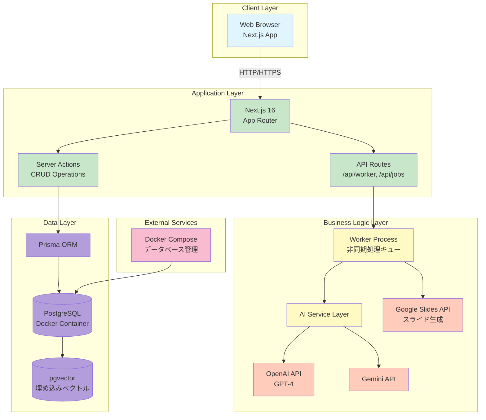
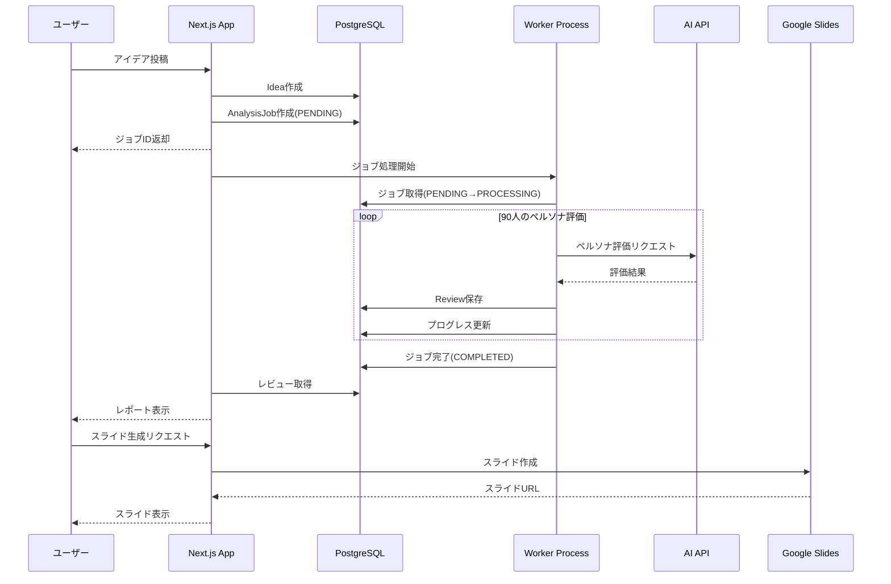

# システム構成図

## 概要
Market Mirrorアプリケーションのシステム構成をMermaid.js形式で表現した図です。

## システム構成図

## データフロー図

## コンポーネント詳細

### 1. Client Layer（クライアント層）
- **Web Browser**: ユーザーインターフェース
- **Next.js App**: ReactベースのSPA

### 2. Application Layer（アプリケーション層）
- **Next.js 16 (App Router)**: フロントエンドとバックエンドを統合
- **Server Actions**: サーバーサイドのCRUD操作
- **API Routes**: 非同期処理のためのエンドポイント

### 3. Business Logic Layer（ビジネスロジック層）
- **Worker Process**: 非同期ジョブキュー処理
  - PostgreSQLをキューとして使用
  - 排他制御による安全な処理
  - 90人のペルソナ評価を順次実行
- **AI Service Layer**: AI API呼び出しの抽象化
  - OpenAI API (GPT-4)
  - Gemini API
- **Google Slides API**: レポートのスライド生成

### 4. Data Layer（データ層）
- **Prisma ORM**: 型安全なデータベースアクセス
- **PostgreSQL**: リレーショナルデータベース
  - Dockerコンテナで実行
  - トランザクション管理
- **pgvector**: ベクトル埋め込みの保存
  - アイデアの類似度検索に使用

### 5. External Services（外部サービス）
- **Docker Compose**: データベースの管理と起動

## 非同期処理フロー

### Job Queue Architecture
1. **ジョブ作成**: ユーザーがアイデアを投稿すると、`AnalysisJob`が`PENDING`状態で作成される
2. **Worker起動**: `/api/worker/process-queue`エンドポイントが呼び出される
3. **排他制御**: トランザクション内でジョブを`PROCESSING`に更新（他のWorkerが取得できないように）
4. **順次処理**: 90人のペルソナに対して順次AI評価を実行
5. **プログレス更新**: 各評価完了時に`currentStep`を更新
6. **完了処理**: 全評価完了後、ジョブを`COMPLETED`に更新

### エラーハンドリング
- **ゾンビジョブ防止**: タイムアウト処理で長時間`PROCESSING`のジョブを`FAILED`に変更
- **リトライ機能**: 失敗したジョブを再実行可能
- **エラーログ**: 詳細なエラー情報を`error`フィールドに保存

## 技術スタック

### Frontend
- Next.js 16 (App Router)
- React 19
- TypeScript
- Tailwind CSS

### Backend
- Next.js Server Actions
- Next.js API Routes
- Prisma ORM

### Database
- PostgreSQL 15+
- pgvector (ベクトル検索)

### External APIs
- OpenAI API (GPT-4)
- Google Gemini API
- Google Slides API

### Infrastructure
- Docker & Docker Compose
- Node.js 18+
